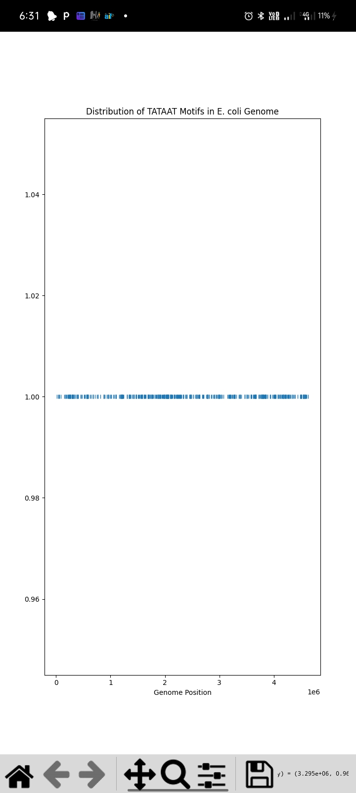
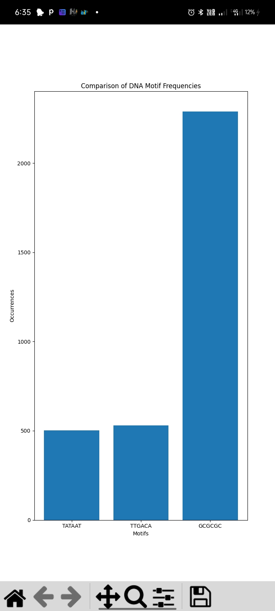

# DNA Motif Analysis in Escherichia coli

## Overview
This project performs computational identification and comparative analysis of conserved DNA motifs in the genome of Escherichia coli using Python, Biopython, and Matplotlib.

## Objectives
- Load bacterial genome data
- Identify promoter motifs
- Calculate motif frequencies
- Determine motif positions
- Visualize motif distribution
- Compare motif frequencies

## Tools Used
- Python
- Biopython
- Matplotlib
- Pydroid 3

## Dataset
Escherichia coli K-12 MG1655 genome downloaded from NCBI Genome Database.

## Repository Contents

- code1_genome_loading.py
- code2_motif_frequency.py
- code3_motif_positions.py
- code4_distribution_plot.py
- code5_comparative_analysis.py
- motif_distribution.jpg
- motif_comparison.jpg

## Results

### Motif Distribution Across Genome

### Comparative Motif Frequency Analysis

## Key Findings
- TATAAT motif: ~504 occurrences
- TTGACA motif: ~530 occurrences
- GCGCGC motif: ~2300 occurrences

## Author
Amalu Regi 
